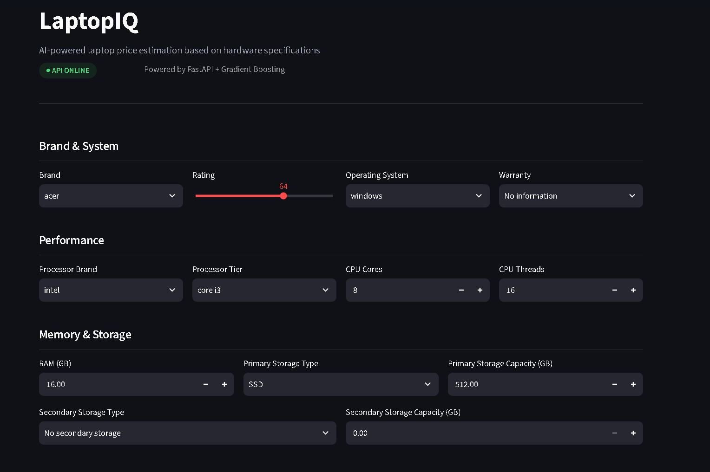
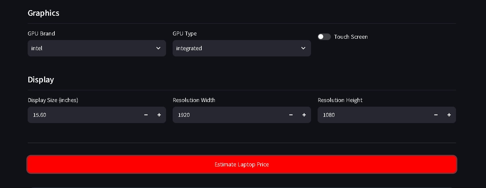
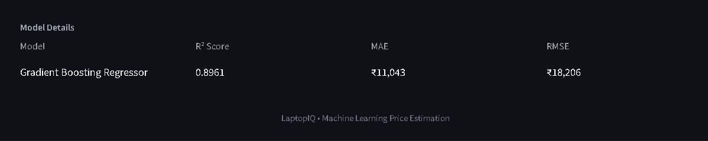

# Laptop Price Prediction

An end-to-end machine learning project that predicts laptop prices (₹) from hardware specifications using regression models.

> **Status: In Progress**
>
> The complete ML pipeline, FastAPI backend, and Streamlit frontend are completed.
> Dockerization and deployment are the next stages.

---

## Table of Contents

- [Laptop Price Prediction](#laptop-price-prediction)
  - [Table of Contents](#table-of-contents)
  - [Screenshots](#screenshots)
    - [LaptopIQ — Price Prediction Interface](#laptopiq--price-prediction-interface)
    - [Price Prediction](#price-prediction)
    - [Model Details](#model-details)
  - [Pipeline](#pipeline)
  - [Machine Learning](#machine-learning)
    - [Models Evaluated](#models-evaluated)
    - [Final Model](#final-model)
  - [Feature Engineering](#feature-engineering)
  - [FastAPI](#fastapi)
    - [API Structure](#api-structure)
    - [Running the API](#running-the-api)
    - [Key Endpoints](#key-endpoints)
  - [Streamlit Frontend](#streamlit-frontend)
    - [Running the Frontend](#running-the-frontend)
  - [Project Structure](#project-structure)
  - [Getting Started](#getting-started)
    - [Installation](#installation)
    - [Usage](#usage)
  - [Tech Stack](#tech-stack)
  - [Roadmap](#roadmap)

---

## Screenshots

### LaptopIQ — Price Prediction Interface




### Price Prediction


### Model Details



---

## Pipeline

| Step | Notebook | Output |
|---|---|---|
| 1. EDA | `notebooks/01_eda.ipynb` | Insights and visualizations |
| 2. Data Cleaning | `notebooks/02_data_cleaning.ipynb` | `data/processed/laptops_cleaned.csv` |
| 3. Feature Engineering | `notebooks/03_feature_engineering.ipynb` | `data/processed/laptops_features.csv` |
| 4. Model Training | `notebooks/04_model_training.ipynb` | `src/models/gb_baseline.pkl`, `preprocessor.pkl` |
| 5. Model Tuning | `notebooks/05_model_tuning.ipynb` | `src/models/laptop_price_pipeline.pkl` |

The notebooks are designed to be executed in order, with each stage using the output generated by the previous stage.

---

## Machine Learning

### Models Evaluated

The following regression models were evaluated:

- Linear Regression
- Random Forest Regressor
- Gradient Boosting Regressor
- XGBoost Regressor
- K-Nearest Neighbors Regressor

### Final Model

**Gradient Boosting Regressor**

The baseline Gradient Boosting model achieved better test-set performance than the Optuna-tuned model, so the baseline model was selected as the final production model.

| Model | MAE (₹) | RMSE (₹) | R² |
|---|---:|---:|---:|
| Random Forest | 12,140.52 | 20,388.59 | 0.8638 |
| Gradient Boosting | **11,043.35** | **18,206.07** | **0.8961** |
| XGBoost | 11,498.33 | 19,701.21 | 0.8783 |
| KNN | 12,322.92 | 22,270.33 | 0.8445 |

Optuna hyperparameter tuning was performed using 10-fold cross-validation, but the tuned model did not outperform the baseline on the held-out test set.

---

## Feature Engineering

The following features were engineered from the original laptop specifications:

- `total_storage_capacity`
- `total_pixels`
- `ppi`

These features are also calculated automatically by the FastAPI backend during prediction.

---

## FastAPI

The trained ML pipeline is exposed through a FastAPI backend.

### API Structure

```text
app/
├── main.py
├── config.py
├── schemas.py
└── predictor.py
```

- **`main.py`** — Application entry point; defines API routes (`/predict`, `/health`, `/model-info`).
- **`config.py`** — Configuration and environment settings (model paths, CORS, etc.).
- **`schemas.py`** — Pydantic request/response models for input validation.
- **`predictor.py`** — Loads the trained pipeline and handles feature engineering + inference.

### Running the API

```bash
uvicorn app.main:app --reload
```

By default the API is served at `http://127.0.0.1:8000`, with interactive docs available at `http://127.0.0.1:8000/docs`.

### Key Endpoints

| Method | Endpoint | Description |
|---|---|---|
| `GET` | `/health` | Health check for the API |
| `GET` | `/model-info` | Returns model name and evaluation metrics |
| `POST` | `/predict` | Accepts laptop specifications and returns a predicted price |

---

## Streamlit Frontend

A Streamlit app (`app.py`) provides a UI for entering laptop specifications and viewing predictions in real time. It calls the FastAPI backend via `api_client.py` and displays:

- Live API health status
- A grouped, spec-driven input form (Brand & System, Performance, Memory & Storage, Graphics, Display)
- Predicted price with model details (R², MAE, RMSE)

### Running the Frontend

```bash
streamlit run frontend/app.py
```

> Make sure the FastAPI server is running first, since the frontend depends on it for predictions and model info.

---

## Project Structure

```text
laptop/
├── app/
│   ├── __init__.py
│   ├── config.py
│   ├── main.py
│   ├── predictor.py
│   └── schemas.py
├── data/
│   ├── processed/
│   │   ├── laptops_cleaned.csv
│   │   └── laptops_features.csv
│   └── raw/
│       └── laptops.csv
├── frontend/
│   ├── __init__.py
│   ├── api_client.py
│   ├── app.py
│   └── styles.py
├── images/
│   ├── laptopiq-interface.png
│   ├── laptopiq-model-details.png
│   └── laptopiq-prediction.png
├── notebooks/
│   ├── 01_eda.ipynb
│   ├── 02_data_cleaning.ipynb
│   ├── 03_feature_engineering.ipynb
│   ├── 04_model_training.ipynb
│   └── 05_model_tuning.ipynb
├── src/
│   └── models/
│       ├── gb_baseline.pkl
│       ├── laptop_price_pipeline.pkl
│       ├── preprocessor.pkl
│       └── train_test_data.pkl
├── .gitignore
├── README.md
└── requirements.txt
```

---

## Getting Started


### Installation

```bash
git clone https://github.com/<your-username>/laptop-price-prediction.git
cd laptop-price-prediction
pip install -r requirements.txt
```

### Usage

1. Start the FastAPI backend:
   ```bash
   uvicorn app.main:app --reload
   ```
2. In a separate terminal, start the Streamlit frontend:
   ```bash
   streamlit run frontend/app.py
   ```
3. Open the app in your browser (Streamlit will print the local URL, typically `http://localhost:8501`).

---

## Tech Stack

- **Language:** Python
- **ML/Data:** scikit-learn, XGBoost, Optuna, pandas, NumPy
- **Backend:** FastAPI, Pydantic, Uvicorn
- **Frontend:** Streamlit
- **Notebooks:** Jupyter

---

## Roadmap

- [x] Exploratory data analysis
- [x] Data cleaning & feature engineering
- [x] Model training & tuning
- [x] FastAPI backend
- [x] Streamlit frontend
- [ ] Dockerize backend and frontend
- [ ] Deploy to cloud (e.g. Render / Railway / AWS)

---
